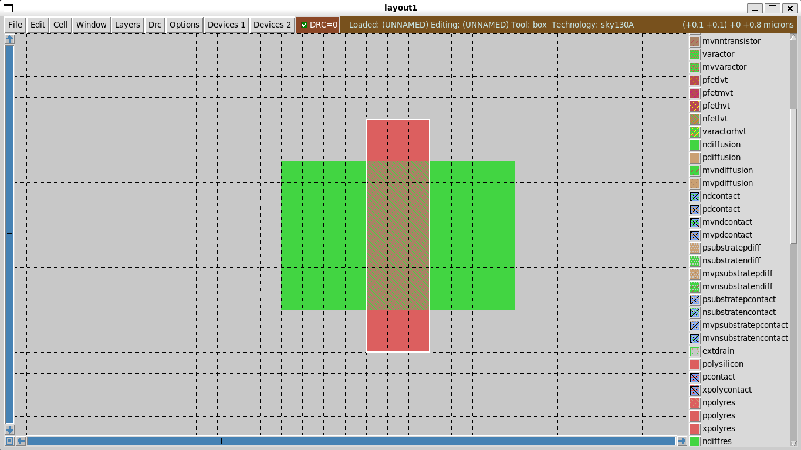

# CMOS Inverter Layout (Magic VLSI – Sky130)

This README documents the physical layout of a CMOS inverter using **Magic VLSI** and the **Sky130 PDK**.
The schematic was first verified, then prepared specifically for layout by defining proper ports and removing all simulation-only elements.

---

## Tools Used

* **Magic VLSI**
* **Sky130 PDK**
* **Xschem**
* Linux environment

---

## Schematic Preparation for Layout

### Port Definition (IO Pins, not LabPins)

Instead of LabPins, I used proper **IO symbols** in Xschem:

* `iopin` → Power and ground (`VDD`, `VSS`)
* `ipin` → Input (`VIN`)
* `opin` → Output (`VOUT`)

These define the physical ports used during layout and LVS.

### Stripped Layout Schematic

A separate schematic file was saved that contains:

* Only **NMOS and PMOS**
* Only the defined IO pins (`VDD`, `VSS`, `VIN`, `VOUT`)
* All simulation components removed (sources, capacitor, code blocks)

This schematic is dedicated for layout and netlist export.


| Signal | Type  | Function      |
| ------ | ----- | ------------- |
| VIN    | ipin  | Input signal  |
| VOUT   | opin  | Output signal |
| VDD    | iopin | Power supply  |
| VSS    | iopin | Ground        |

Configured as a top-level subcircuit and exported for Magic.

---

## Critical Issue

**Transistor channel lengths were resized to satisfy Sky130 design rules.**

* Minimum practical length ≈ **150 nm**
* Prevents DRC and LVS errors

---

## Magic VLSI Startup (Important)

Do NOT run `magic` alone.
Always start Magic with the Sky130 tech file:

```bash
export PDK_ROOT=/home/timi/eda_tools/open_pdks/sky130
magic -rcfile /home/timi/eda_tools/open_pdks/sky130/sky130A/libs.tech/magic/sky130A.magicrc
```

---

## Three Methods of Designing in Magic

There are three ways to create devices in Magic:

---

### 1. Manual Drawing (Layer by Layer)

In this method, the transistor is created by manually drawing fabrication layers.

Steps:

* Draw **N-diffusion**
* Draw **polysilicon** crossing the diffusion
* Magic automatically forms a transistor at the intersection

Example commands:

```tcl
paint ndiffusion
paint poly
```

Magic automatically creates an `ntransistor` where poly crosses N-diffusion.

**Example Output:**



*Striped pattern shows the ntransistor region formed*

This method helps in understanding how a MOSFET is physically constructed, but it is slow and not efficient for large designs.

---

### 2. Using Built-in Device Cells (devices1)

NMOS and PMOS can be added directly from the **devices1** menu.

Steps:

* Add NMOS or PMOS cell
* Edit device properties
* Set only:

  * **Width (W)**
  * **Length (L)**

This method is much faster than manual drawing and was used for this layout.


*Device Parameterization: It allows you to change variables (parameters) to automatically redraw the layout.*


*The Built-in Device cell - NMOS*

---

### 3. Importing the SPICE Netlist (Instructor Method)

The schematic's `.spice` netlist can be imported directly into Magic to auto-generate the layout.

This method was demonstrated by the instructor and is useful for larger designs.

---

## CMOS Inverter Layout

### Layout Diagrams


*Figure 1: Full inverter layout (DRC = 0)*


*Figure 2: PMOS region with VDD*


*Figure 3: NMOS region with VIN, VOUT, and VSS*

---

## Layout Arrangement

* `VDD` at the top, `VSS` at the bottom
* PMOS near VDD, NMOS near VSS
* Devices stacked vertically

---

## Routing Strategy

* Same metal layer touching = connected
* Different layers require **contacts / vias**

### Drain (Output Node)

* PMOS drain connected to NMOS drain
* Routed using **Metal2**
* `Via1` connects Metal2 ↔ Metal1

### Source Connections

* PMOS source → VDD (Metal1)
* NMOS source → VSS (Metal1)
* Body contacts tied to supplies

### Gate Connection

* PMOS gate and NMOS gate connected together
* Routed using Metal2
* Via1 used at gate contacts

---

## Design Rule Check (DRC)

* Checked spacing and via overlaps
* All violations fixed
* Final layout is **DRC clean**

---

## Files Included

* `layout.mag` — Magic layout file
* `layout_design.sch` — stripped schematic with IO ports only
* `README.md`
* PNG images of schematic and layout

---