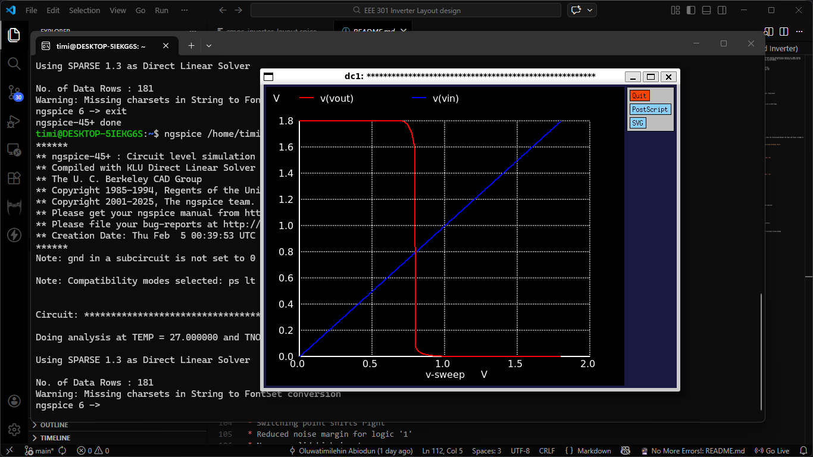
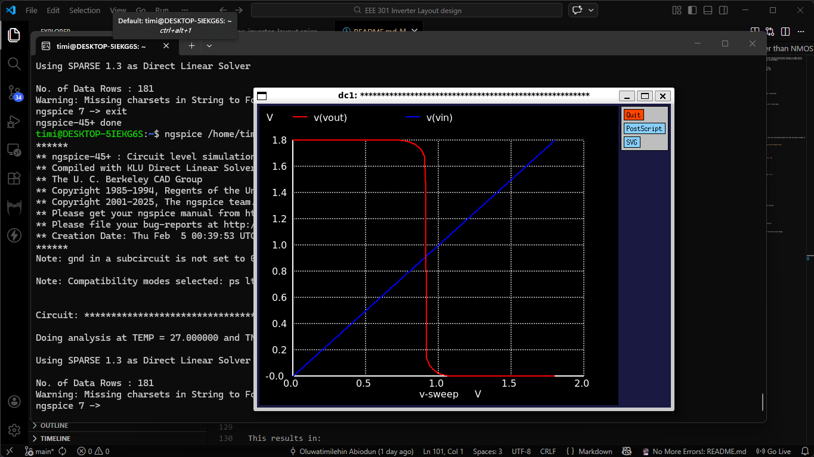

# CMOS Inverter – DC Analysis (ngspice)

This folder shows the DC sweep (VTC) analysis of a CMOS inverter using ngspice and Sky130 models. Files used: `inverter.sch` (schematic), `TT.spice` (Sky130 models). Open `inverter.sch` in Xschem to run simulations.

## Objectives

* Plot the Voltage Transfer Characteristic (VTC)
* Determine switching threshold (Vm)
* Study effect of transistor sizing

## DC Sweep Command
```spice
.dc Vin 0 1.8 0.01
```

Sweeps Vin from 0V to 1.8V in 0.01V steps.

## Voltage Transfer Characteristic

* Vin low → Vout high
* Vin high → Vout low
* Vm ≈ 0.9 V (VDD = 1.8 V)

### Case 1: Wp < Wn



* Switching point shifts left
* Skewed VTC, reduced logic '0' noise margin
* Not recommended

### Case 2: Wp >> Wn


* Switching point shifts right
* Skewed VTC, reduced logic '1' noise margin
* Not recommended

### Optimal: Wp ≈ 1.7 Wn ≈ 1



* Balanced VTC
* Switching point near VDD/2
* Maximum noise margins

## Notes

* Proper transistor sizing improves noise margin and reliability
* This stage prepares for layout, DRC/LVS, and post-layout simulations