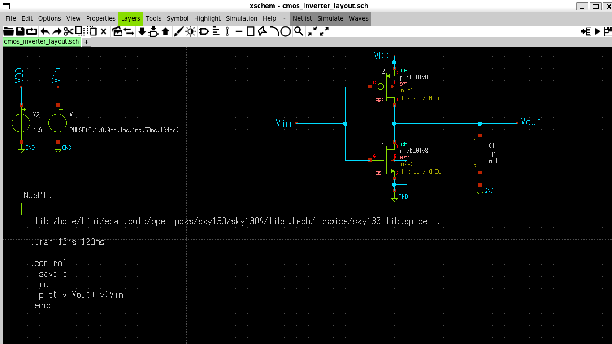

# CMOS Inverter Schematic Design (Xschem)

This section documents how I designed the CMOS inverter schematic using Xschem and the Sky130 PDK.

## CMOS Inverter Schematic



*Figure: CMOS inverter schematic designed in Xschem using Sky130 PDK.*

# CMOS Inverter Schematic File

The working schematic is available as:
```
inverter.sch
```

Open this file in Xschem to view or run simulations directly.

## Opening Xschem

I started by opening Xschem from the Linux terminal:
```bash
xschem
```

## Importing Components

To insert symbols, I used **Shift + I** (Insert).

### MOSFETs (from Sky130 PDK)

* NMOS
* PMOS

These were imported from the Skywater PDK library because they are devices that will be fabricated.

### Other Components (from Xschem library)

* Voltage sources (VDD and Vin)
* Ground (GND)
* Capacitor (capa.sym)
* LabPin symbols
* Code symbol (`code_shown.sym`)

## Connecting the Circuit

The wire tool was activated using the **W** key.

* PMOS was placed above NMOS
* Drains of PMOS and NMOS were connected together
* Gates of NMOS and PMOS were connected together
* Source of PMOS connected to VDD
* Source of NMOS connected to GND

## Node Naming (LabPins)

LabPins were used to name important nodes:

* **VIN** → gates of NMOS and PMOS
* **VOUT** → joined drains
* **VDD** → PMOS source

A capacitor was connected between VOUT and ground as the load capacitor.

Voltage sources were connected to LabPins to keep the schematic clean and avoid excessive wiring.

## Editing Component Properties

Symbol properties were edited using the **Q** key.

### VIN (Pulse Input)
```
PULSE(0 1.8 0ns 1ns 1ns 15ns 104ns)
```

### VDD
```
1.8 V
```

## Simulation Setup

The Sky130 transistor model was included using:
```
.lib "/home/timi/eda_tools/open_pdks/sky130/sky130A/libs.tech/ngspice/sky130.lib.spice" tt
```

### Transient Analysis Code
```
.tran 10ns 100ns
.control
  save all
  run
  plot v(Vout) v(Vin)
.endc
```

This runs a transient analysis from 10 ns to 100 ns and plots Vout against Vin.

## Final Notes

* NMOS and PMOS were imported from the Sky130 PDK
* Other components were imported from the Xschem library
* LabPins were used for neat node connections
* The schematic was verified using transient analysis

This schematic is the foundation for DC analysis and layout design.